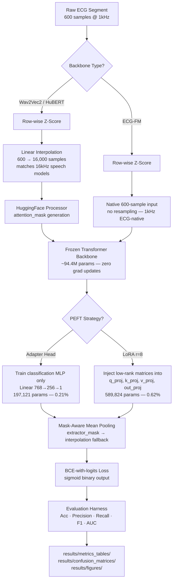

# ECG-PEFT Bench 🫀
### LoRA vs. Adapter Fine-Tuning for Cardiac Foundation Models · Wav2Vec2 / HuBERT / ECG-FM

[](https://python.org)
[](https://pytorch.org)
[](https://huggingface.co)
[](https://github.com/huggingface/peft)
[](LICENSE)

> **ECG-PEFT Bench** is a medical AI research system that benchmarks parameter-efficient fine-tuning strategies for binary ECG segment classification — comparing LoRA vs. frozen-encoder Adapter approaches across three cardiac foundation models, with a mask-aware pooling pipeline and automated evaluation harness.

---

## 🎯 What Makes This Different from Standard PEFT Benchmarks

Most PEFT benchmarks do: `pretrained model → attach adapter → fine-tune → evaluate`

ECG-PEFT Bench does:
```
raw ECG (600 samples @ 1kHz)
  → path-aware preprocessing (row-wise z-score + model-specific resampling)
  → frozen backbone with PEFT injection
  → mask-aware mean pooling (extractor mask → interpolation fallback)
  → BCE-with-logits head
  → evaluation across 3 backbones × 2 strategies with exact confusion matrices
```

This is **principled benchmarking** — the same data, splits, seed, and training config across all six configurations so every result difference is attributable to backbone or adaptation method, not experimental noise.

---

## 🏗️ Architecture



### Node Responsibilities

| Component | Role |
|---|---|
| **Preprocessing** | Row-wise z-score normalization; linear interpolation to 16kHz for speech models; native 1kHz passthrough for ECG-FM |
| **Frozen Backbone** | Wav2Vec2 / HuBERT (speech-pretrained) or ECG-FM (ECG-native); all weights frozen |
| **PEFT Injection** | Adapter Head (freeze all, train MLP only) or LoRA (inject rank-8 matrices into attention projections) |
| **Mask-Aware Pooling** | Uses `extractor_attention_mask` from backbone; falls back to interpolated input mask to prevent padding contamination |
| **Evaluation Harness** | Identical test split, threshold, and metrics across all 6 configurations |

---

## 📊 Results

All results on the **held-out test set** (9,814 samples, ~49.8% positive — balanced).

| Model | Method | Accuracy | Precision | Recall | F1 | AUC-ROC |
|---|---|---|---|---|---|---|
| **Wav2Vec2** | **LoRA** | **0.5836** | **0.5797** | 0.5983 | **0.5889** | **0.6196** |
| Wav2Vec2 | Adapter | 0.5676 | 0.5559 | 0.6594 | 0.6033 | 0.5953 |
| HuBERT | LoRA | 0.5636 | 0.5458 | 0.7420 | 0.6290 | 0.6027 |
| HuBERT | Adapter | 0.5348 | 0.5202 | **0.8592** | 0.6481 | 0.5886 |

**Key findings:**
- **Wav2Vec2 + LoRA** — best balanced performance across all metrics. Best choice for screening where both error types carry cost.
- **HuBERT + Adapter** — highest recall (0.859). Catches the most true positives. Appropriate for high-sensitivity triage where missing a cardiac event is clinically unacceptable.
- **HuBERT + LoRA** — middle ground: recall=0.742 with meaningfully better precision than the full adapter variant.
- **LoRA consistently outperforms** on AUC across both Wav2Vec2 and HuBERT, suggesting low-rank weight updates generalize better than head-only adaptation for this task.

📎 Full methodology, ablations, and per-model analysis: [`report/ecg-peft-benchmark-report.pdf`](report/ecg-peft-benchmark-report.pdf)

---

## ⚙️ Engineering Challenges Solved

**Audio model compatibility with PEFT**
HuggingFace PEFT's `get_peft_model()` calls `enable_input_require_grads()` internally, which hooks into the model's token embedding layer. Audio models (Wav2Vec2, HuBERT) have no token embeddings — they consume raw waveforms. This causes a runtime crash. Fix: patch the method to a no-op before wrapping, then manually bind a BCE-with-logits forward to replace the default CE loss that HF uses for `num_labels=1`:
```python
def _noop_enable_input_require_grads(self): return
model.enable_input_require_grads = _noop_enable_input_require_grads.__get__(model, type(model))
```

**Mask-aware pooling across downsampled sequence lengths**
The CNN feature extractor in Wav2Vec2/HuBERT downsamples 16,000 input samples to ~49 transformer frames. Naively mean-pooling over all frames includes padding tokens from shorter-sequence batches, corrupting the pooled representation. The solution uses a two-tier mask strategy: prefer `extractor_attention_mask` (natively downsampled by the backbone) and fall back to `F.interpolate(..., mode="nearest")` on the input mask when unavailable.

**Resampling without introducing periodicity artifacts**
Upsampling 600 ECG samples to 16,000 for speech models is non-trivial. Zero-padding introduces hard signal boundaries; repeat-tiling introduces artificial periodicity; cubic spline is smoother but computationally heavier. Linear interpolation on a normalized [0,1] coordinate grid is the lowest-bias option for 1D biomedical signal upsampling and was used for all Wav2Vec2/HuBERT experiments.

**ECG-FM checkpoint integration with fallback**
The `mimic_iv_ecg_finetuned.pt` checkpoint is a proprietary weight file. The pipeline includes a `SimpleECGBackbone` fallback (1D CNN) so the code remains fully executable without the checkpoint — while the results in the report reflect the loaded checkpoint variant.

---

## 🚀 Quick Start

### Prerequisites
- Python 3.10+
- CUDA GPU recommended; CPU and Apple MPS (tested on M3 Pro) also supported

### Installation

```bash
git clone https://github.com/krishnakoushik225/ecg-peft-benchmark
cd ecg-peft-benchmark
python -m venv .venv
source .venv/bin/activate   # Windows: .venv\Scripts\activate
pip install -r requirements.txt
```

### Data Setup

Place your ECG dataset CSV at the path referenced in the notebook:
```
df_segment2.csv   # (N, 601): 600 signal columns + 1 binary label column
```

### Run

```bash
jupyter notebook notebooks/lab_3.ipynb
```

Execute end-to-end — covers preprocessing, PEFT injection, training, and full evaluation for all model/method combinations.

---

## 🔬 Worked Example

**Input:** ECG segment, 600 samples @ 1kHz, binary label = 1 (abnormal)

**Pipeline trace (Wav2Vec2 + LoRA path):**
```
[Preprocessing]  → row-wise z-score → linear interp 600→16,000 samples
[Processor]      → input_values (1, 16000), attention_mask (1, 16000)
[Backbone]       → frozen Wav2Vec2 → last_hidden_state (1, 49, 768)
[Pooling]        → extractor_mask (1, 49) → masked mean → pooled (1, 768)
[LoRA Head]      → logit (1, 1) → sigmoid → prob = 0.71
[Prediction]     → prob ≥ 0.5 → label = 1 ✓ (correct)
```

**Trainable parameters active in this path:**
```
LoRA matrices (q/k/v/out × 12 layers):   589,824 params   (0.62% of model)
Frozen backbone:                       94,568,833 params   (zero grad updates)
```

---

## 🛠️ Tech Stack

| Layer | Technology |
|---|---|
| Foundation Models | `facebook/wav2vec2-base`, `facebook/hubert-base-ls960`, ECG-FM (`mimic_iv_ecg_finetuned.pt`) |
| PEFT Methods | HuggingFace PEFT — LoRA (r=8, α=16); Frozen-encoder Adapter Head |
| ML Framework | PyTorch 2.0+ + HuggingFace Transformers |
| Evaluation | scikit-learn (accuracy, F1, AUC, confusion matrix) |
| Notebook | Jupyter |
| Hardware | Apple M3 Pro (MPS) / CUDA GPU |

---

## 📁 Project Structure

```
ecg-peft-benchmark/
├── notebooks/
│   └── lab_3.ipynb                  # End-to-end pipeline — all 6 configurations
├── report/
│   └── ecg-peft-benchmark-report.pdf  # Full technical report
├── results/
│   ├── figures/                     # Training curves, ROC plots
│   ├── confusion_matrices/          # Per-model confusion matrix heatmaps
│   └── metrics_tables/              # Accuracy, F1, AUC summary tables
├── docs/
│   └── architecture.md              # Deep-dive: implementation details & design decisions
└── README.md
```

---

## 💡 Why These PEFT Methods?

Two fundamentally different adaptation philosophies are in tension here:

**Adapter Head** modifies nothing inside the backbone — it trains only on frozen representations. It's the ultimate regularizer: the backbone's pretrained weights are completely untouched. But it also means the backbone's representations are never adjusted for the ECG domain, however subtly.

**LoRA** injects rank-8 update matrices into every attention projection. With r=8 and α=16 (effective scale 2.0), the updates are constrained to a low-dimensional subspace — but they do adjust the internal attention patterns. The result, as seen in the benchmark, is consistently better AUC at the cost of slightly lower recall.

The benchmark directly quantifies this tradeoff rather than assuming one method dominates.

---

## 🔭 Roadmap

- [ ] QLoRA (4-bit quantization) for resource-constrained clinical hardware
- [ ] ONNX export for inference pipeline packaging
- [ ] Threshold calibration beyond binary 0.5 cutoff
- [ ] Cross-dataset generalization: PTB-XL, PhysioNet Challenge
- [ ] Multi-class arrhythmia classification (extending beyond binary)
- [ ] MLflow / W&B experiment tracking for reproducible audit trails
- [ ] Human-in-the-loop review checkpoint before classification output

---

## 📄 License

MIT — free to use and build on. If you use this in research, a citation would be appreciated.

---

*Built by [Krishna Koushik Unnam](https://github.com/krishnakoushik225) · M.S. Trustworthy AI, University of South Florida*